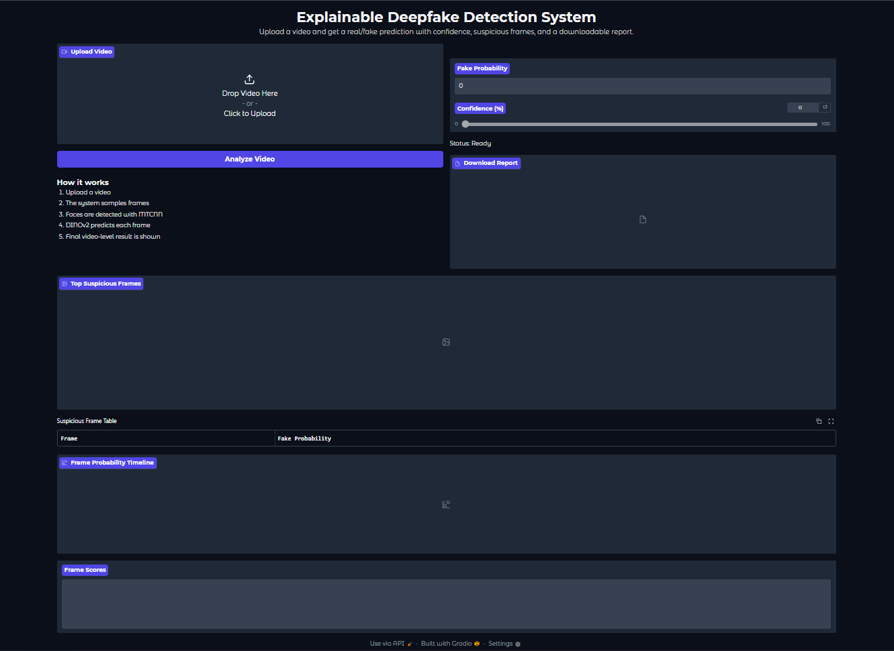
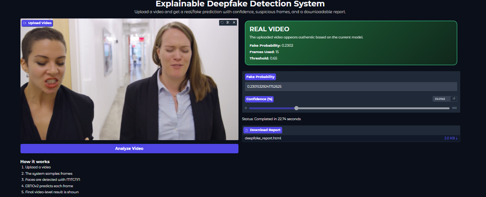
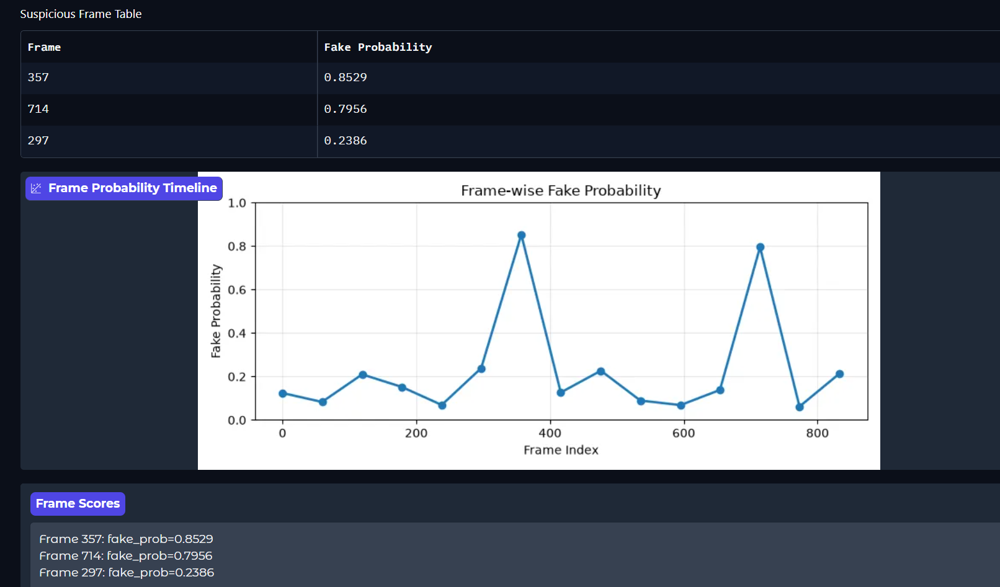
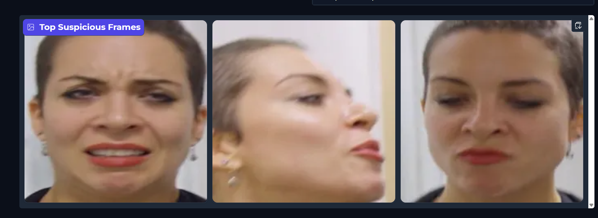

# 🔍 Explainable Deepfake Detection using Fine-Tuned DINOv2

<p align="center">


</p>

---

## 📖 Overview

Deepfakes generated using modern AI models have become increasingly realistic, making manual detection extremely difficult. This project presents an **Explainable Deepfake Detection System** built using a **fine-tuned DINOv2 Vision Transformer** for video-level classification.

The application allows users to upload a video and receive:

- 🎯 Real/Fake prediction
- 📊 Confidence score
- 🖼️ Top suspicious frames
- 📈 Frame-wise fake probability timeline
- 📄 Downloadable forensic report

The goal is not only to classify videos accurately but also to provide **visual evidence** supporting the prediction.

---

# ✨ Features

- 🎥 Upload any video for analysis
- 🧠 Fine-tuned DINOv2 Vision Transformer
- 👤 Face Detection using MTCNN
- 📈 Frame-wise fake probability estimation
- 📊 Video-level prediction
- 📸 Suspicious frame visualization
- 📉 Frame probability timeline
- 📄 Downloadable HTML forensic report
- 🌐 Interactive Gradio Web Interface

---

# 🏗️ System Architecture

```
                  Video Upload
                       │
                       ▼
              Frame Extraction
                       │
                       ▼
              Face Detection (MTCNN)
                       │
                       ▼
               Image Preprocessing
                       │
                       ▼
        Fine-Tuned DINOv2 Vision Transformer
                       │
                       ▼
         Frame-wise Fake Probability Scores
                       │
                       ▼
        Video-level Probability Aggregation
                       │
                       ▼
        Explainable Deepfake Detection Result
```

---

# 🧠 Model Details

| Component | Description |
|-----------|-------------|
| Backbone | DINOv2 Vision Transformer |
| Fine-Tuning | Binary Deepfake Classification |
| Face Detector | MTCNN |
| Framework | PyTorch |
| Interface | Gradio |
| Computer Vision | OpenCV |
| Report Generation | HTML |

---

# 📊 Experimental Results

## Video-Level Performance

| Metric | Score |
|---------|-------|
| Accuracy | **94.00%** |
| Precision | **92.74%** |
| Recall | **97.67%** |
| F1-score | **95.15%** |
| ROC-AUC | **98.76%** |

---

## Previous Experiments

| Experiment | Accuracy |
|------------|----------|
| DenseNet201 + Logistic Regression | 82.45% |
| RGB + FFT Fusion | 89.60% |
| DenseNet + Xception Fusion | 91.00% |
| Fine-tuned DenseNet201 | 91.20% |
| Fine-tuned DINOv2 | **94.00%** |

---

# 💻 User Interface

The application provides an interactive interface that displays:

- Upload Video
- Prediction Result
- Confidence Score
- Suspicious Frames
- Frame Probability Timeline
- Downloadable Report

---

## 📸 Screenshots

## Home Screen



## Prediction



## Timeline



## Suspicious Frames



---

# 📂 Project Structure

```
Explainable-Deepfake-Detection
│
├── app.py
├── inference.py
├── model_def.py
├── requirements.txt
├── README.md
│
├── models
│   └── dinov2_phase2_best_2500.pt
│
├── assets
│   └── screenshots
│
└── temp
```

---

# ⚙️ Installation

Clone the repository

```bash
git clone https://github.com/vedant333444/Explainable-Deepfake-Detection.git
```

Move into the project

```bash
cd Explainable-Deepfake-Detection
```

Create virtual environment

```bash
python -m venv .venv
```

Activate virtual environment

Windows

```bash
.venv\Scripts\activate
```

Linux / macOS

```bash
source .venv/bin/activate
```

Install dependencies

```bash
pip install -r requirements.txt
```

---

# ▶️ Run the Application

```bash
python app.py
```

Open your browser

```
http://127.0.0.1:7860
```

---

# 📁 Input

- MP4
- AVI
- MOV

---

# 📤 Output

The application returns

- Real/Fake Prediction
- Confidence Score
- Suspicious Frames
- Frame-wise Probability Timeline
- Downloadable Report

---

# 🛠️ Technologies Used

| Category | Technology |
|----------|------------|
| Programming Language | Python |
| Deep Learning | PyTorch |
| Vision Transformer | DINOv2 |
| Face Detection | MTCNN |
| Computer Vision | OpenCV |
| Visualization | Matplotlib |
| Interface | Gradio |
| Image Processing | Pillow |
| Numerical Computing | NumPy |
| Data Processing | Pandas |

---

# 🚀 Future Improvements

- Attention Rollout Visualization
- Grad-CAM for Explainability
- Multi-face Analysis
- Batch Video Processing
- REST API
- Hugging Face Deployment
- Docker Support
- React + FastAPI Interface
- User Authentication
- Cloud Deployment

---

# 📚 Research Inspiration

This project was developed as part of an undergraduate research project focusing on explainable deepfake detection using Vision Transformers.

The implementation was inspired by recent advances in:

- Vision Transformers
- Self-Supervised Learning
- Explainable Artificial Intelligence (XAI)
- Deepfake Detection

---

# ⚠️ Disclaimer

This project is intended for educational and research purposes only.

The predictions generated by the model should not be considered legal or forensic evidence.

---

# 👨‍💻 Author

**Rohan Kalme**

B.Tech — Computer Science & Design

Machine Learning • Computer Vision • Deep Learning

GitHub:
https://github.com/vedant333444

---

# ⭐ Support

If you found this project useful, consider giving it a ⭐ on GitHub.

It helps others discover the project and supports future development.

---

## 📄 License

This project is licensed under the MIT License.
